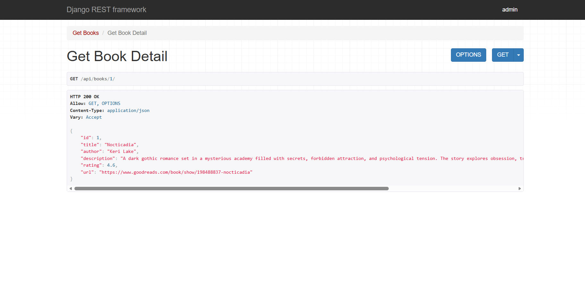
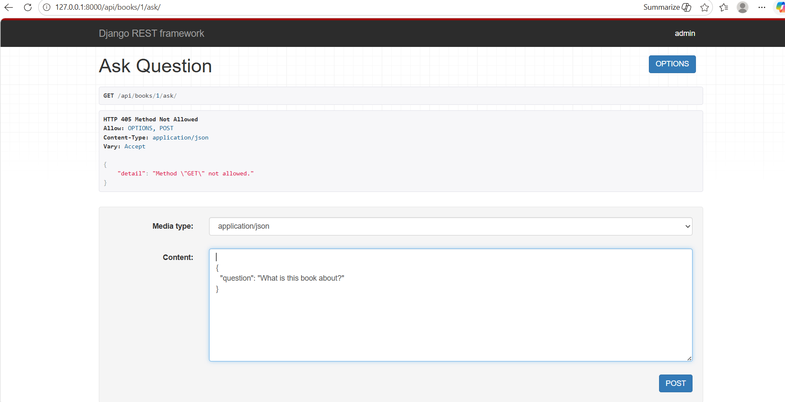
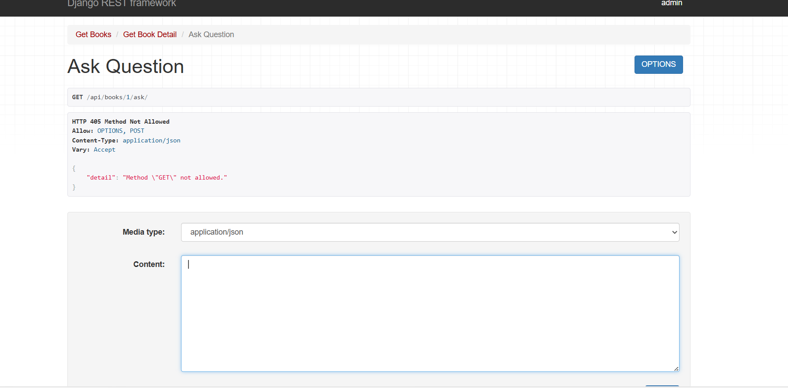
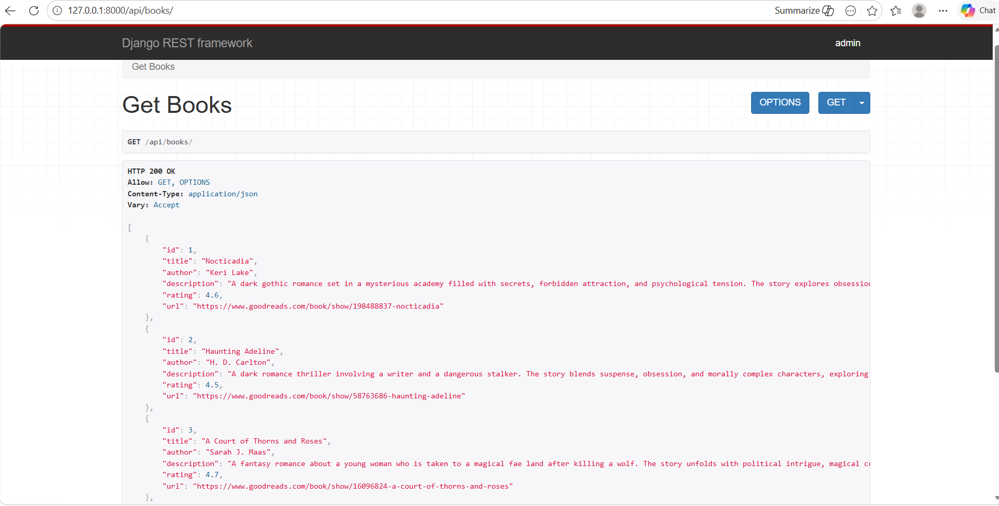
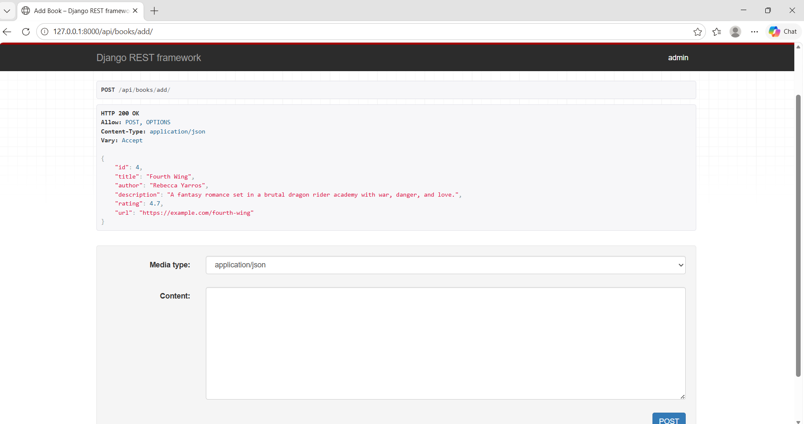

# 📚 Book AI Platform

## 🚀 Overview

This project is a Book AI Platform built using Django REST Framework and Hugging Face Transformers. It allows users to manage books and interact with AI-powered features such as summarization and question answering.

The system demonstrates how backend development can be combined with Natural Language Processing (NLP) to build intelligent applications.

---

## ✨ Features

* Get all books
* Get book details
* Add new books
* AI-based book summary
* Ask questions about books (RAG-based system)

---

## 🛠 Tech Stack

* Backend: Django, Django REST Framework
* AI/NLP: Hugging Face Transformers
* Database: SQLite

---

## ⚙️ Setup Instructions

```bash
git clone https://github.com/your-username/book-ai-platform
cd book-ai-platform
pip install -r requirements.txt
python manage.py runserver
```

---

## 📌 API Endpoints

### 1. Get All Books

GET /api/books/

### 2. Get Book Detail

GET /api/books/<id>/

### 3. Add Book

POST /api/books/add/

### 4. Get Summary

GET /api/books/<id>/summary/

### 5. Ask Question

POST /api/books/<id>/ask/

Request Body:

```json
{
  "question": "What is this book about?"
}
```

---

## 🤖 AI Features

* **Summarization**: Generates concise summaries from book descriptions
* **Question Answering**: Answers user queries based on book content
* **RAG Approach**: Uses book description as context to generate relevant answers

---

## 🧠 Architecture

The project follows a modular backend architecture using Django REST Framework. Models define the database schema, serializers handle data conversion, and views manage business logic and API responses.

The AI layer is integrated using Hugging Face Transformers, where a summarization model generates summaries and a question-answering model processes user queries using the book description as context. This creates a simple Retrieval-Augmented Generation (RAG) pipeline.

---

## 📈 Future Improvements

* Integrate vector database (FAISS)
* Add frontend (React)
* Improve model accuracy and response quality
* Deploy using cloud platforms

---
## 📸 Screenshots








---
